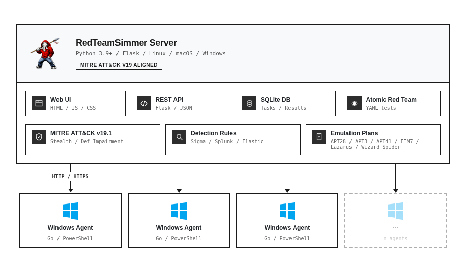

<p align="center">
  
</p>

<h1 align="center">RedTeamSimmer</h1>

<p align="center">
  <strong>The UI You've Always Wanted for Atomic Red Team</strong><br>
A Web Based Adversary Emulation Platform and Atomic Red Team Test Orchestration.
</p>

<p align="center">
  <a href="https://github.com/breachsimrange/redteamsimmer/releases"></a>
  <a href="https://github.com/breachsimrange/redteamsimmer/blob/main/LICENSE"></a>
  <a href="https://github.com/breachsimrange/redteamsimmer/stargazers"></a>
  <a href="https://twitter.com/breachsimrange"></a>
</p>

---

## Overview

**RedTeamSimmer** is an open-source, web based adversary emulation platform providing a modern UI for orchestrating Atomic Red Team tests across enterprise Windows environments. It was initially created for 'Mastering Breach and Adversarial Attack Simulation' training at DEF CON Trainings. Traditional atomic tests execution demands memorizing PowerShell syntax, manually managing prerequisites per endpoint, and collecting scattered results with no centralized visibility. RedTeamSimmer solves this with a Flask server, lightweight Golang agents, and a real-time web interface enabling security teams to execute MITRE ATT&CK mapped techniques in few clicks. Operators deploy agents to multiple endpoints, browse the full ATT&CK catalog, run tests with automatic prerequisite handling, and monitor live color-coded output from a single dashboard. 

RedTeamSimmer bridges the gap between complex adversary emulation tooling and practical usability - giving you the power of Atomic Red Team with a clean, intuitive interface.

It also ships with adversary emulation plans modelled using Atomic Red Team for real threat actors including APT28, APT3, APT41, FIN7, Lazarus Group, and Wizard Spider for multi-stage attack simulations. Detection rule mappings for Sigma, Splunk, and Elastic Security help blue teams identify coverage gaps and validate alerting. A full operations history provides a complete audit trail for compliance. Designed for red teamers, blue teamers, purple team exercises, EDR/AV testing, and training.

RedTeamSimmer is created and maintained by the [BreachSimRange](https://breachsimrange.io) team. The original RedTeamSimmer was created by @abhijithbr.

---

## Features

### MITRE ATT&CK Integration

RedTeamSimmer organizes all atomic tests by MITRE ATT&CK tactics, making it easy to navigate and select techniques for execution.

- **Tactic-Based Navigation** - Tests are grouped under their respective MITRE ATT&CK v19 tactics (Initial Access, Execution, Persistence, Privilege Escalation, Stealth, Defense Impairment, Credential Access, Discovery, Lateral Movement, Collection, Command and Control, Exfiltration, Impact). v19 (April 2026) split the legacy Defense Evasion tactic into Stealth (TA0005) and Defense Impairment (TA0112) — see [docs/UPDATES.md](docs/UPDATES.md) for the full migration notes.
- **Technique Details** - View full technique descriptions, supported platforms, executor types, and elevation requirements before execution
- **Sub-Technique Support** - Properly handles sub-techniques (e.g., T1059.001 PowerShell under T1059 Command and Scripting Interpreter)
- **ATT&CK Links** - Direct links to MITRE ATT&CK documentation for each technique

### Multi-Agent Architecture

Deploy lightweight agents on target systems and orchestrate test execution remotely from the central server.

- **Go-Based Agent** - Compiled, standalone binary with no external dependencies
- **Agent Registration** - Agents automatically register with the server and report system information (hostname, username, OS, architecture)
- **AV Detection** - Agents detect 60+ antivirus/EDR products including CrowdStrike, SentinelOne, Carbon Black, Defender, and more
- **Configurable Polling** - Adjustable poll intervals and jitter timing for stealth
- **Startup Persistence** - Optional persistence via registry, scheduled tasks, or startup folder
- **Remote Shutdown** - Clean agent removal with full artifact cleanup

> **Note:** Currently only **Windows agents** are fully supported. Linux/macOS agent support is planned for future releases.

### Live Execution Output

Test output streams in real time as the agent executes, not after completion, so you can watch prerequisites run, the main command fire, and cleanup trigger as it happens. Output types - stdout, stderr, and agent messages - can be toggled independently to cut noise. Each test phase is separated by decorative log banners, timed individually, and the exit code surfaces immediately on completion.

### Prerequisite Management

Atomic tests often need tools or files in place before they execute. RedTeamSimmer parses the YAML test definition, runs the `prereq_command` to check whether dependencies are already satisfied, and if not, runs `get_prereq_command` to install them. A re-verification step confirms the prerequisites are in place before the main command fires. If you want to skip this - for example when you have already staged the target - the UI exposes a manual override to run the test directly.

### Threat Actor Emulation Plans

RedTeamSimmer ships with pre-built emulation plans modelled on real-world APT tradecraft. Each plan chains together Atomic Red Team tests mapped to the techniques documented in the corresponding MITRE ATT&CK group profile, so you execute the actor's kill chain in sequence rather than running isolated techniques. Plans are JSON-defined, fully editable, and extensible - you can modify ordering, add or remove techniques, or build your own from scratch using the custom plan builder.

**Included Plans:**

| Threat Actor | Origin | Focus |
|--------------|--------|-------|
| **APT28 (Fancy Bear)** | Russia - GRU Unit 26165 | Government espionage, election interference, credential harvesting |
| **APT3 (Gothic Panda)** | China - MSS | Aerospace, defence, and telecom targeting |
| **APT41 (Wicked Panda)** | China - dual-use | Hybrid espionage and financially motivated intrusions |
| **FIN7 (Carbanak)** | Financially motivated (eCrime) | POS malware, retail and hospitality breach patterns |
| **Lazarus Group** | North Korea - RGB | Financial theft, destructive attacks, cryptocurrency operations |
| **Wizard Spider** | Financially motivated (eCrime) | Ryuk/Conti ransomware kill chains, credential access, lateral movement |

Each plan includes the attack chain ordering, `-GetPrereqs` flags for test dependencies, and MITRE technique IDs for ATT&CK Navigator layer export. Execution runs techniques sequentially across one or more agents with full output captured per step.

### Dashboard & Reporting

The dashboard gives you a single view of active agents with online/offline status, total emulations executed, technique coverage count, success and failure statistics, recent task history, and a failed operations list for quick triage.

Three chart types visualise the operational picture - a doughnut chart for task status distribution, a bar chart for tactic coverage, and a pie chart for agent status breakdown.

The MITRE ATT&CK Heatmap renders executed techniques against the ATT&CK matrix with colour-coded status (completed, failed, running, pending), click-through to detailed output, and live updates as operations progress.

### View Details Modal

The details modal is where you drill into a single technique execution. The execution summary shows the technique ID, exit code, and duration at a glance, followed by a parsed breakdown of test name, description, executor, and platform. Input arguments are displayed in both their raw form (with variable placeholders) and resolved form (with actual values), so you can see exactly what ran. The prerequisite, main command, and cleanup sections each display their own output streams with syntax highlighting. Cleanup commands are shown for reference but not auto-executed. External links route to MITRE ATT&CK, SigmaHQ, and the Atomic Red Team repository for further investigation.

### Detection Rules Integration

Every executed technique is correlated against detection rules from three sources:

- **Sigma Rules** - generic detections convertible to any SIEM format
- **Splunk Queries** - ready-to-use SPL queries
- **Elastic Rules** - detections for Elastic Security

Rules are matched automatically against the technique ID, with a count summary per technique and expandable views for full query content. Direct links route to the upstream rule repositories. The rule database is local and offline, so no external API calls fire during execution - useful when running in restricted or air-gapped environments.

### Operations Management

The operations view lists every operation with status, progress, and timestamps. Running operations can be paused, resumed, or stopped from the interface. Progress is shown as a percentage completion bar, and clicking into any operation opens the full execution timeline with a per-technique results table (status, duration, exit codes) and a filterable log view for debugging specific runs.

### File Drop System

When an emulation requires specific technique folders on the target, the server bundles them into a ZIP archive and distributes to the selected agents. Agents confirm successful extraction before execution begins, and the staged files are removed after the test completes or when the agent shuts down cleanly.

### Agent Management

The agent list shows every registered agent with status indicators alongside hostname, username, OS, architecture, and last-seen time. AV detection results are displayed per agent so you can see exactly which security products are installed on the target. Agent configuration - startup persistence, jitter timing, metadata - can be modified from the UI without redeploying the binary. The remote shutdown action cleanly removes the agent along with its artifacts: registry entries, scheduled tasks, and dropped files.

---

## Architecture



> **Interactive diagram:** [docs/architecture.html](docs/architecture.html) — open in a browser for the full visual with component details and legend.

```
┌──────────────────────────────────────────────────────────────────────┐
│                        RedTeamSimmer Server                          │
│                          (Python / Flask)                            │
│                                                                      │
│  ┌───────────┐  ┌───────────┐  ┌──────────────┐  ┌───────────────┐  │
│  │  Web UI   │  │ REST API  │  │ SQLite DB    │  │ Atomic Red    │  │
│  │ HTML / JS │  │ Endpoints │  │ Tasks/Results│  │ Team (YAML)   │  │
│  └───────────┘  └───────────┘  └──────────────┘  └───────────────┘  │
│                                                                      │
│  ┌───────────────────┐  ┌────────────────────┐  ┌────────────────┐  │
│  │ MITRE ATT&CK v19.1│  │  Detection Rules   │  │ Emulation Plans│  │
│  │ Stealth + Def Imp │  │ Sigma/Splunk/Elastic│  │ 6 APT actors  │  │
│  └───────────────────┘  └────────────────────┘  └────────────────┘  │
└──────────────────────────────────────────────────────────────────────┘
                    │                │                │
                    │  HTTP / HTTPS  │                │
                    ▼                ▼                ▼
          ┌──────────────┐  ┌──────────────┐  ┌──────────────┐
          │ Windows Agent│  │ Windows Agent│  │ Windows Agent│  ...
          │  (Go Binary) │  │  (Go Binary) │  │  (Go Binary) │
          │  PowerShell  │  │  PowerShell  │  │  PowerShell  │
          └──────────────┘  └──────────────┘  └──────────────┘
```

---

## Installation

### Prerequisites

- **Python 3.9+**
- **Go 1.19+** (for building agents - see [installation steps below](#installing-go-for-building-agents))
- **Git**
- **Windows target systems** (for agent deployment)

### Server Setup

The server can run on Windows, Linux, or macOS.

```bash
# Clone the repository
git clone https://github.com/breachsimrange/RedTeamSimmer.git
cd RedTeamSimmer
```

#### Python Virtual Environment (Recommended)

Always run RedTeamSimmer inside a Python virtual environment. This isolates dependencies from the system Python and avoids conflicts with other tools on the host.

```bash
# Create the virtual environment
python3 -m venv venv

# Activate (Linux / macOS)
source venv/bin/activate

# Activate (Windows PowerShell)
venv\Scripts\Activate.ps1

# Activate (Windows CMD)
venv\Scripts\activate.bat
```

When the venv is active your shell prompt will be prefixed with `(venv)`. Run every subsequent server command - `pip install`, `python app.py`, etc. - inside the activated venv. To deactivate when finished:

```bash
deactivate
```

> **Tip:** If you redeploy the server on another host, recreate the venv on that host rather than copying it - venvs contain absolute paths.

#### Install Server Dependencies

```bash
# With the venv activated:
pip install --upgrade pip
pip install -r requirements.txt

# Download Atomic Red Team atomics
git clone https://github.com/redcanaryco/atomic-red-team.git atomics_repo
mv atomics_repo ./atomic
rm -rf atomics_repo

# Initialize the database and create default admin user
python3 app.py
```

### Installing Go (for building agents)

Go is required to compile the Windows agent binary. The agent can be cross-compiled from any host with Go installed - you do not need Go on the target Windows machine, only on the system you build the binary on.

**Linux (Ubuntu/Debian/RHEL):**

```bash
# Check https://go.dev/dl/ for the latest stable version
GO_VERSION=1.22.5
wget https://go.dev/dl/go${GO_VERSION}.linux-amd64.tar.gz

# Remove any previous Go install and extract
sudo rm -rf /usr/local/go
sudo tar -C /usr/local -xzf go${GO_VERSION}.linux-amd64.tar.gz

# Add Go to PATH (persisted across shells)
echo 'export PATH=$PATH:/usr/local/go/bin' >> ~/.bashrc
source ~/.bashrc

# Verify
go version
# Expected: go version go1.22.5 linux/amd64
```

**macOS:**

```bash
# Option 1: Homebrew
brew install go

# Option 2: Download the .pkg installer from https://go.dev/dl/ and run it

# Verify
go version
```

**Windows:**

1. Download the MSI installer from <https://go.dev/dl/>.
2. Run the installer - it adds Go to the system `PATH` automatically.
3. Open a new PowerShell or CMD window and confirm:

   ```powershell
   go version
   ```

> **Distro package managers:** `apt install golang-go` and `dnf install golang` work but often ship outdated versions. Prefer the official tarball or installer for current toolchain features.

### Agent Setup (Windows Only)

> **Important:** Currently only Windows agents are fully functional. Linux and macOS agent support is under development.

```bash
# Navigate to agent directory
cd agent

# Edit agent.go and update the ServerURL
# Find this line and change the IP/hostname:
# ServerURL = "http://YOUR_SERVER_IP:5000"

# Build Windows agent (from any OS with Go installed)
GOOS=windows GOARCH=amd64 go build -o agent.exe agent.go

# Or on Windows directly:
go build -o agent.exe agent.go
```

**Agent Configuration Options (in agent.go):**

```go
const (
    ServerURL              = "http://192.168.1.100:5000"  // Your server address
    AdminToken             = "ChangeThisAdminToken!"       // Must match server token
    PollInterval           = 7 * time.Second              // How often to check for tasks
    FiledropPoll           = 5 * time.Second              // How often to check for files
)
```

### Downloading Detection Rules

RedTeamSimmer integrates with external detection rule sources. Use the provided scripts to download and generate the rule mappings.

#### Quick Setup (Recommended)

The easiest way to download all detection rules is to use the provided shell script:

```bash
# Navigate to detection folder
cd detection

# Make script executable
chmod +x download-detection-rules.sh

# Run the downloader
./download-detection-rules.sh
```

This script will:
1. Download **AttackRuleMap** (Sigma + Splunk rules mapped to Atomic tests)
2. Fetch and parse **Elastic Detection Rules** using the Python script

#### Manual Setup

If you prefer to run the scripts manually:

**Step 1: Download AttackRuleMap (Sigma + Splunk Rules)**

[AttackRuleMap](https://github.com/krdmnbrk/AttackRuleMap) provides Sigma and Splunk detection rules mapped to Atomic Red Team tests.

```bash
# Download the mapping file directly
curl -sL https://raw.githubusercontent.com/krdmnbrk/AttackRuleMap/main/attack_rule_map.json \
  -o detection/attack_rule_map.json

# Verify download
python3 -c "import json; print(f'Loaded {len(json.load(open(\"detection/attack_rule_map.json\")))} entries')"
```

**Step 2: Fetch Elastic Detection Rules**

The `fetch_elastic_rules.py` script clones the Elastic detection-rules repository, parses TOML rule files, and extracts MITRE ATT&CK technique mappings.

```bash
# Navigate to detection folder
cd detection

# Run the fetcher script
python3 fetch_elastic_rules.py
```


**Requirements for fetch_elastic_rules.py:**
- Git installed and in PATH
- Python 3.6+
- `toml` module (auto-installed if missing)

#### Detection Rules Directory Structure

After running the scripts, your detection folder should look like:

```
redteamsimmer/
├── detection/
│   ├── download-detection-rules.sh    # Main download script
│   ├── fetch_elastic_rules.py         # Elastic rules fetcher
│   ├── attack_rule_map.json           # Sigma + Splunk rules (downloaded)
│   └── elastic_rules.json             # Elastic rules (generated)
├── app.py
├── agent/
└── ...
```

#### Updating Detection Rules

To refresh the detection rules with the latest from upstream:

```bash
# Re-run the download script
cd detection
./download-detection-rules.sh
```

Or update individually:

```bash
# Update AttackRuleMap only
curl -sL https://raw.githubusercontent.com/krdmnbrk/AttackRuleMap/main/attack_rule_map.json \
  -o detection/attack_rule_map.json

# Update Elastic rules only
cd detection && python3 fetch_elastic_rules.py
```

After updating rules, restart the Flask server to reload the detection database.

### PowerShell Modules (Required for Agent)

The agent requires PowerShell modules for test execution. Place these in the `modules/` directory on the server:

```bash
mkdir -p modules

# Download Invoke-AtomicRedTeam
# Visit: https://github.com/redcanaryco/invoke-atomicredteam
# Download and zip the module, place as modules/Invoke-AtomicRedTeam.zip

# Download powershell-yaml
# Visit: https://github.com/cloudbase/powershell-yaml
# Download and zip the module, place as modules/powershell-yaml.zip

# Download AtomicTestHarness
```

The agent will automatically download these modules from the server on first run.

---

## Quick Start

### 1. Start the Server

```bash
# Activate the venv first if not already
source venv/bin/activate

# Development mode
python app.py

# The server starts on http://localhost:5000
```

### 2. Login

Navigate to `http://localhost:5000` and login with default credentials:

| Username | Password |
|----------|----------|
| `redteamsimmer`  | `redteamsimmer`  |

> **Change the default password immediately after first login!**

### 3. Deploy Agent (Windows Only)

Copy the compiled `agent.exe` to your Windows target system and run:

```powershell
# Run as Administrator for full capability
.\agent.exe
```

The agent will:
1. Register with the server
2. Download required PowerShell modules
3. Begin polling for tasks

Verify the agent appears in the **Agents** section of the web UI.

### 4. Execute Tests

1. Go to **Execute Technique** in the sidebar
2. Expand tactic accordions to see available techniques
3. Check the boxes next to techniques you want to execute
4. Select your target agent(s) in the agent table
5. Optionally check **Get Prerequisites** to auto-install dependencies
6. Click **Execute Selected Tests**
7. Watch live output in the console below

### 5. View Results

- **Live Output** - Streams in real-time during execution
- **Test Results Table** - Shows pass/fail status for each technique
- **View Details** - Click to see full command output, arguments, and detection rules
- **Operations** - View historical operations and their results

---

## Deployment

### Running as a Service (systemd)

For Linux production deployments, run RedTeamSimmer as a systemd service so it starts on boot, restarts on failure, and writes structured logs to the journal. The service runs against a venv installed at `/opt/redteamsimmer/venv` - adjust the paths if you deploy elsewhere.

#### Step 1: Stage the Application

```bash
# Create the deploy directory and copy the source
sudo mkdir -p /opt/redteamsimmer
sudo cp -r ./* /opt/redteamsimmer/
cd /opt/redteamsimmer
```

#### Step 2: Create a Service User

A dedicated unprivileged user limits blast radius if the process is compromised.

```bash
sudo useradd --system --shell /bin/false --home-dir /opt/redteamsimmer redteamsimmer
sudo chown -R redteamsimmer:redteamsimmer /opt/redteamsimmer
```

#### Step 3: Create the venv and Install Dependencies

```bash
# Run as the service user so file ownership is correct
sudo -u redteamsimmer python3 -m venv /opt/redteamsimmer/venv
sudo -u redteamsimmer /opt/redteamsimmer/venv/bin/pip install --upgrade pip
sudo -u redteamsimmer /opt/redteamsimmer/venv/bin/pip install -r /opt/redteamsimmer/requirements.txt
```

#### Step 4: Create the Service File

Create `/etc/systemd/system/redteamsimmer.service`:

```ini
[Unit]
Description=RedTeamSimmer Adversary Emulation Platform
After=network.target

[Service]
Type=simple
User=redteamsimmer
Group=redteamsimmer
WorkingDirectory=/opt/redteamsimmer
Environment="PATH=/opt/redteamsimmer/venv/bin"
ExecStart=/opt/redteamsimmer/venv/bin/python app.py --port 5000
Restart=always
RestartSec=10

# Security hardening
NoNewPrivileges=true
PrivateTmp=true
ProtectSystem=full
ProtectHome=true

[Install]
WantedBy=multi-user.target
```

> **Note:** `ExecStart` points directly at the venv's Python interpreter, so the service runs in the venv without needing explicit activation. Setting `Environment="PATH=..."` ensures any subprocesses (e.g., `git`, `python3`) also resolve to venv binaries first.

#### Step 5: Enable and Start

```bash
# Reload systemd to pick up the new unit file
sudo systemctl daemon-reload

# Enable on boot and start now
sudo systemctl enable --now redteamsimmer

# Verify it's running
sudo systemctl status redteamsimmer

# Tail logs in real time
sudo journalctl -u redteamsimmer -f
```

#### Common service commands

```bash
sudo systemctl restart redteamsimmer   # restart after config/code changes
sudo systemctl stop redteamsimmer      # stop the service
sudo systemctl disable redteamsimmer   # don't start on boot
```

---

## Configuration

### Server Configuration

**Environment Variables:**

| Variable | Description | Default |
|----------|-------------|---------|
| `RTS_SECRET_KEY` | Flask session secret key | Random |
| `RTS_PORT` | Server port | `5000` |
| `RTS_DEBUG` | Enable debug mode | `false` |
| `RTS_ATOMIC_ROOT` | Path to atomics folder | `./atomics` |

### Agent Configuration

Edit these constants in `agent.go` before building:

```go
const (
    ServerURL              = "http://192.168.1.100:5000"  // Server address
    AdminToken             = "ChangeThisAdminToken!"       // Authentication token
    AtomicsDir             = "./atomics"                   // Local atomics path
    PollInterval           = 7 * time.Second              // Task poll interval
    FiledropPoll           = 5 * time.Second              // File poll interval
    InvokeAtomicModuleDir  = "./Invoke-AtomicRedTeam"     // Module directory
)
```
### Production Deployment with SSL

#### Option 1: Self-Signed Certificate (Internal Use)

```bash
# Create SSL directory
mkdir -p ssl

# Generate self-signed certificate
openssl req -x509 -nodes -days 365 -newkey rsa:2048 \
  -keyout ssl/server.key \
  -out ssl/server.crt \
  -subj "/C=US/ST=State/L=City/O=Organization/CN=redteamsimmer.local"

# Run with SSL
python app.py --ssl --cert ssl/server.crt --key ssl/server.key --port 443
```

**Update agent.go for HTTPS:**

```go
ServerURL = "https://redteamsimmer.local"
```

> **Note:** For self-signed certificates, you may need to add certificate verification bypass in the agent or install the CA certificate on target systems.

#### Option 2: Let's Encrypt (Public Facing)

```bash
# Install certbot
sudo apt install certbot

# Obtain certificate (ensure port 80 is accessible)
sudo certbot certonly --standalone -d yourdomain.com

# Run with Let's Encrypt certificate
python app.py --ssl \
  --cert /etc/letsencrypt/live/yourdomain.com/fullchain.pem \
  --key /etc/letsencrypt/live/yourdomain.com/privkey.pem \
  --port 443
```

**Auto-renewal:**

```bash
# Add to crontab
0 0 1 * * certbot renew --quiet && systemctl restart redteamsimmer
```

#### Option 3: Reverse Proxy with Nginx (Recommended)

**Install Nginx:**

```bash
sudo apt install nginx
```

**Configure Nginx (`/etc/nginx/sites-available/redteamsimmer`):**

```nginx
server {
    listen 443 ssl http2;
    server_name redteamsimmer.yourdomain.com;

    ssl_certificate /etc/letsencrypt/live/yourdomain.com/fullchain.pem;
    ssl_certificate_key /etc/letsencrypt/live/yourdomain.com/privkey.pem;

    # SSL configuration
    ssl_protocols TLSv1.2 TLSv1.3;
    ssl_ciphers ECDHE-ECDSA-AES128-GCM-SHA256:ECDHE-RSA-AES128-GCM-SHA256;
    ssl_prefer_server_ciphers off;

    # Security headers
    add_header X-Frame-Options "SAMEORIGIN" always;
    add_header X-Content-Type-Options "nosniff" always;
    add_header X-XSS-Protection "1; mode=block" always;

    location / {
        proxy_pass http://127.0.0.1:5000;
        proxy_http_version 1.1;
        proxy_set_header Upgrade $http_upgrade;
        proxy_set_header Connection "upgrade";
        proxy_set_header Host $host;
        proxy_set_header X-Real-IP $remote_addr;
        proxy_set_header X-Forwarded-For $proxy_add_x_forwarded_for;
        proxy_set_header X-Forwarded-Proto $scheme;
        
        # Timeout settings for long-running tests
        proxy_read_timeout 300s;
        proxy_connect_timeout 75s;
    }
}

server {
    listen 80;
    server_name redteamsimmer.yourdomain.com;
    return 301 https://$server_name$request_uri;
}
```

**Enable the site:**

```bash
sudo ln -s /etc/nginx/sites-available/redteamsimmer /etc/nginx/sites-enabled/
sudo nginx -t
sudo systemctl reload nginx
```

---

## Troubleshooting

### Agent Not Connecting

1. Verify `ServerURL` in agent.go matches your server address
2. Check firewall allows traffic on the server port
3. Ensure server is running and accessible
4. Check agent console output for error messages

### YAML Not Found Errors

The agent handles sub-techniques (e.g., T1059.001) by searching multiple paths. If you see YAML errors:

1. Verify the atomics folder was correctly downloaded
2. Check the technique folder exists in `./atomics/`
3. Ensure the YAML file is present (e.g., `atomics/T1059/T1059.yaml`)

### Prerequisites Failing

1. Run agent as Administrator for full capability
2. Check PowerShell execution policy: `Set-ExecutionPolicy Bypass -Scope Process`
3. Verify PowerShell modules are downloaded to agent directory

### Detection Rules Not Loading

1. Verify detection folder contains `attack_rule_map.json` and `elastic_rules.json`
2. Re-run `./download-detection-rules.sh` to regenerate
3. Check server logs for JSON parsing errors
4. Validate JSON: `python3 -c "import json; json.load(open('detection/attack_rule_map.json'))"`

---

## Screenshots

<details>
<summary>📸 Click to expand screenshots</summary>

### Dashboard


### Execute Technique


### MITRE ATT&CK Heatmap


### Live Output


### View Details Modal


</details>

---

## Contributing

### You Could Be Here!

We welcome contributions of all kinds - code, documentation, bug reports, feature ideas, or testing.

### How to Contribute

1. **Fork** the repository
2. **Create** a feature branch (`git checkout -b feature/amazing-feature`)
3. **Commit** your changes (`git commit -m 'Add amazing feature'`)
4. **Push** to the branch (`git push origin feature/amazing-feature`)
5. **Open** a Pull Request

### Contribution Ideas

| Area | Ideas |
|------|-------|
| **Bug Fixes** | Stability improvements, edge case handling |
| **Documentation** | Tutorials, examples, API documentation |
| **UI/UX** | Interface improvements, accessibility |
| **Integrations** | Additional SIEM platforms, ticketing systems |
| **Emulation Plans** | New threat actor TTPs |
| **Linux Agent** | Port agent functionality to Linux |
| **macOS Agent** | Port agent functionality to macOS |
| **Detection** | Additional rule sources, rule validation |

### Development Setup

```bash
# Clone your fork
git clone https://github.com/YOUR_USERNAME/redteamsimmer.git
cd redteamsimmer

# Create development branch
git checkout -b feature/your-feature

# Install dev dependencies
pip install -r requirements-dev.txt

# Run tests
python -m pytest tests/

# Run linting
flake8 app.py
```

### Code Style

- Python: Follow PEP 8
- Go: Run `go fmt` before committing
- JavaScript: Use consistent indentation (2 spaces)
- HTML: Use consistent indentation (2 spaces)

---

## Contributors

<table>
  <tr>
    <td align="center">
      <strong>Abhijith "Abx" B R</strong><br>
      <sub>Author and Project Lead</sub><br>
      <a href="https://github.com/abhijithbr">GitHub</a> •
      <a href="https://twitter.com/abhijithbr">Twitter</a> •
      <a href="https://linkedin.com/in/abhijith-b-r">LinkedIn</a>
    </td>
  </tr>
</table>

*Want to see your name here? [Contribute to the project!](#contributing)*

---

## Author and Organization

### Abhijith "Abx" B R

Security researcher and developer passionate about building tools for the offensive cybersecurity community. Founder of [BreachSimRange](https://breachsimrange.io) and [Adversary Village](https://adversaryvillage.org).

### BreachSimRange

[BreachSimRange](https://breachsimrange.io) is an offensive security consulting and training company specializing in:

- Red Team Operations
- Adversary Emulation
- Penetration Testing
- Security Training

**Connect with us:**

| Platform | Link |
|----------|------|
| Website | [breachsimrange.io](https://breachsimrange.io) |
| Twitter | [@breachsimrange](https://twitter.com/breachsimrange) |
| LinkedIn | [BreachSimRange](https://linkedin.com/company/breachsimrange) |
| Email | contact@breachsimrange.io |

---

## Recent Updates

RedTeamSimmer tracks the latest MITRE ATT&CK release. The current target is **ATT&CK v19.1 (April 2026)**, which split the legacy Defense Evasion tactic into **Stealth (TA0005)** and **Defense Impairment (TA0112)**.

For full details on what changed — repo edits, API additions, per-actor emulation plan updates, atomic test coverage gaps, and what Atomic Red Team upstream still needs to ship for full v19 parity — see:

- **[docs/UPDATES.md](docs/UPDATES.md)** — MITRE ATT&CK v19 migration notes, coverage gap report, upstream wish-list.

Quick highlights from the v19 migration:

- Server, agent, UI, detection rule maps, and all 6 adversary emulation plans (APT3, APT28, APT41, FIN7, Lazarus Group, Wizard Spider) now declare `mitre_version: 19.1`.
- New API endpoints: `GET /api/mitre/version` and `GET /api/mitre/tactics`.
- Vendored v19 dataset at `server/mitre/attack_v19.json` with loader at `server/mitre/mitre.py`.
- Emulation plan aliases refreshed against v19 group pages (APT28 → Forest Blizzard, Lazarus → Diamond Sleet, Wizard Spider → Pistachio Tempest / FIN12, etc.).
- v19-new attributions (T1685 Disable or Modify Tools, T1686 Disable or Modify System Firewall) appended to relevant plans where Atomic Red Team coverage exists.
- Coverage gap report: 47 v19 Stealth technique IDs and 36 Defense Impairment technique IDs currently have no atomic test folder — the [UPDATES doc](docs/UPDATES.md) lists every gap and a prioritized upstream wish-list.

---

## Acknowledgments

- [Atomic Red Team](https://github.com/redcanaryco/atomic-red-team) by Red Canary - The foundation of this platform
- [MITRE ATT&CK](https://attack.mitre.org/) - Framework for adversary tactics and techniques
- [SigmaHQ](https://github.com/SigmaHQ/sigma) - Generic detection rules
- [Elastic Detection Rules](https://github.com/elastic/detection-rules) - Elastic Security rules
- [AttackRuleMap](https://github.com/krdmnbrk/AttackRuleMap) - ATT&CK to detection rule mapping

---

## Disclaimer

**This tool is intended for authorized security testing and educational purposes only.**

Unauthorized access to computer systems is illegal. Always obtain proper authorization before conducting any security assessments. The author and BreachSimRange are not responsible for misuse of this tool.

---

## License

RedTeamSimmer is licensed under the **GNU General Public License v3.0 (GPLv3)**.

```
Copyright (C) 2026 BreachSimRange

This program is free software: you can redistribute it and/or modify
it under the terms of the GNU General Public License as published by
the Free Software Foundation, either version 3 of the License, or
(at your option) any later version.

This program is distributed in the hope that it will be useful,
but WITHOUT ANY WARRANTY; without even the implied warranty of
MERCHANTABILITY or FITNESS FOR A PARTICULAR PURPOSE. See the
GNU General Public License for more details.

You should have received a copy of the GNU General Public License
along with this program. If not, see <https://www.gnu.org/licenses/>.
```

See the [LICENSE](LICENSE) file for the full license text.

### What GPLv3 Means for You

- **Free to use, modify, and self-host** for any purpose, including commercial internal use
- **Modifications must be shared** under GPLv3 if you distribute the software
- **Cannot be combined with proprietary code** in a distributed product
- **Patent grant** - contributors grant patent rights for the code they contribute
- **No warranty** - the software is provided as-is

### Commercial / Enterprise Licensing

Organisations that want to build proprietary derivatives, integrate RedTeamSimmer into closed-source products, or bundle it with commercial software without the GPL source-disclosure obligations can obtain a commercial license from BreachSimRange.

Contact: **contact@breachsimrange.io**

### Contributor License Agreement

Contributions to RedTeamSimmer require signing a Contributor License Agreement (CLA). The CLA grants BreachSimRange the right to use contributed code under both GPLv3 and the commercial license. This keeps the project sustainable and allows the dual-licensing model to work.

The CLA is signed automatically via **CLA Assistant** on your first pull request - no separate paperwork required.

**Third-Party Licenses:**
- [Atomic Red Team](https://github.com/redcanaryco/atomic-red-team) - MIT License (Red Canary)
- [Invoke-AtomicRedTeam](https://github.com/redcanaryco/invoke-atomicredteam) - MIT License (Red Canary)

---

<p align="center">
  <strong>Version 1.0.0</strong><br>
  Made with ❤️ for the security community
</p>

<p align="center">
  <a href="https://github.com/breachsimrange/redteamsimmer">⭐ Star this repo</a> •
  <a href="https://github.com/breachsimrange/redteamsimmer/issues">🐛 Report Bug</a> •
  <a href="https://github.com/breachsimrange/redteamsimmer/issues">💡 Request Feature</a>
</p>
